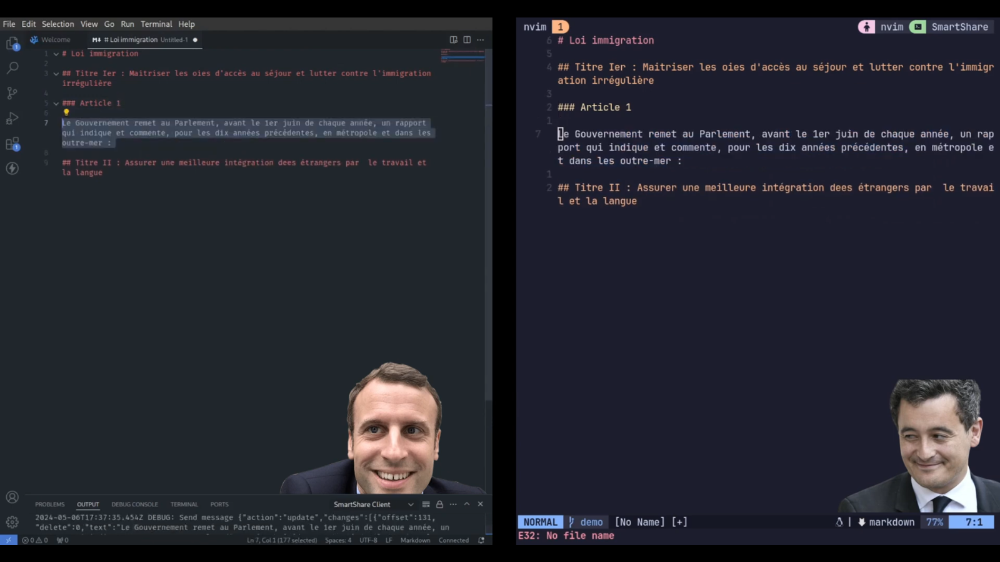
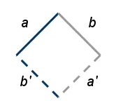
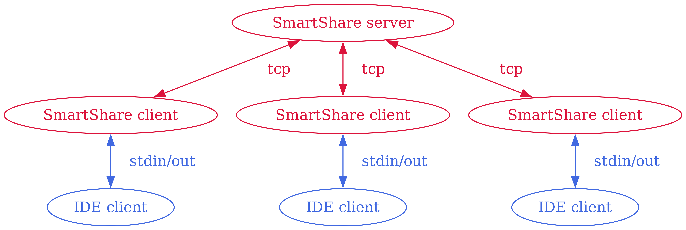
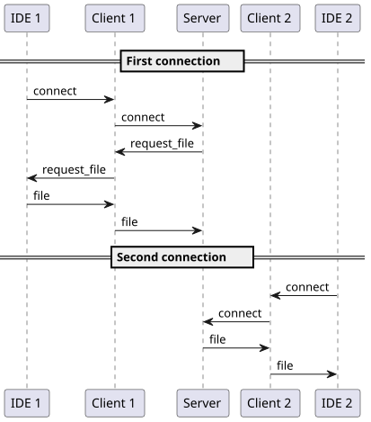
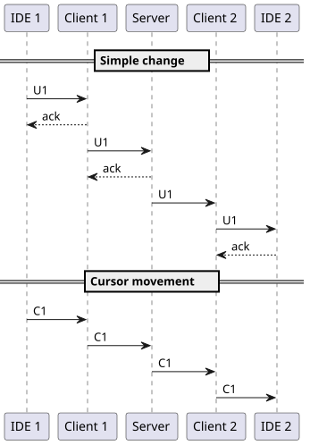
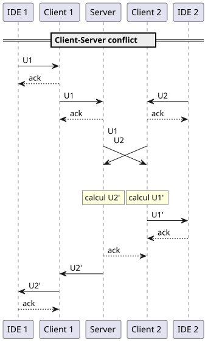
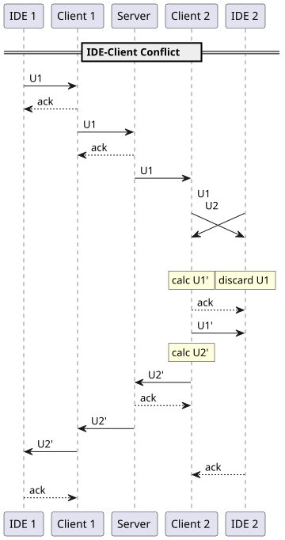

# SmartShare

Collaborate in real time on the same file across different editors. The goal is to make a prototype of an editor-independent clone of [LiveShare]() from VSCode. VSCode and Neovim plugins are available. It was developed by a group of 6 people over 2 weeks.

SmartShare can handle all text editing: insertion, deletion, copy/paste, etc. It displays the cursors of the other connected clients as they move. There is no upper limit to the number of clients who can connect to a session (we have tested up to 6). Sadly, some mysterious bugs desynchronizing the files have been noticed occasionally.

## How it works

### Operational transform

The logic for concurrent editing is based on [operational transform](https://en.wikipedia.org/wiki/Operational_transformation), a technology used in collaborative software to maintain the consistency of the content.

The core principle is that if two people make changes A and B at the same time, then we can compute B' and A' such that, if applied to the two versions respectively, the end result is the same. Therefore, each client just has to send the changes it made, and not the whole modified file.

The [Etherpad and EasySync Technical Manual](https://github.com/ether/etherpad-lite/blob/develop/doc/public/easysync/easysync-full-description.pdf) was a very valuable resource to learn how to implement operational transform in practice.

### Architecture

The software is composed of 3 parts:

- a central server app, keeping track of the "true" version
- a client app, independent of the editor
- an editor plugin, communicating with the client

The server and client are written in Rust, for speed and reliability. The language of the plugin depends on the editor (JS for VSCode, Lua for Neovim).

The goal of this complex architecture over a simpler client/server model is to make the editor plugin as simple as possible, by leaving the logic to the client. This way, new plugins for other editors can be easily developed, as they only have to send and write characters.

### Protocol

The original operational transform protocol was made for a simple client/server architecture, so it was adapted into two protocols to handle conflicts at any point.

When the first client joins the session, it uploads the editor active file to the server. The others client receive the file from the server upon connection to the session. A change can then be sent from one editor to the others. The protocol uses acknowledge packets to ensure the changes were accepted without conflict.

Two types of conflicts can happen: between the server and the client, or the client and the editor plugin.

